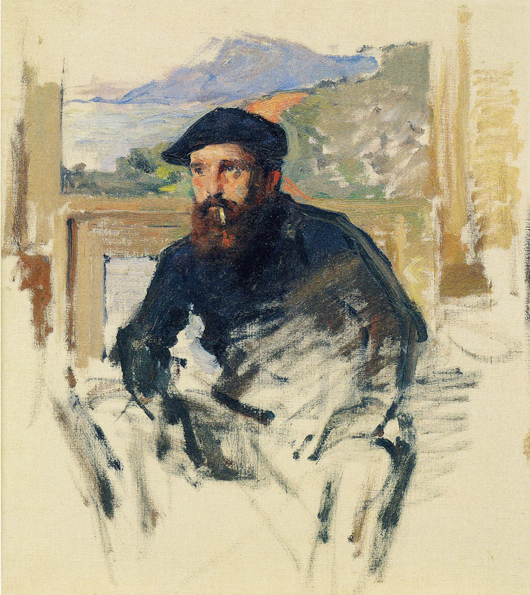
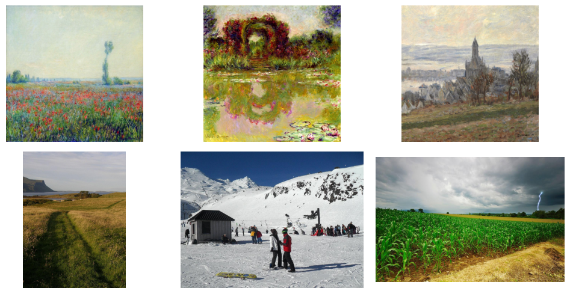

# Image Translation

The project consits of using a Cycle GAN (Generative Adversarial Network) to translate any image into a Claude Monet painting.
I'm going to discuss about the arquitecture of these models and why it is way easier than one might think, pretty intuitive. I hope that you enjoy reading through this repo and get to appreciate the greatness of an artists such as Claude Monet. I will also leave the .pth file and the code on how to set it up in your computer so you can give it a try. 

Thanks for reading!
Luis Martinez

# About Claude Monet

Claude Monet is my favorite artists, one of the things that I admire about him is the peace that his work conveys. I love landscape paintings and the Impressionist movement, most of his paintings were of oil on canvas. 




Other than my admiration for his work and personal bias is that he used the same style through almoast all of his career and his work is readily available to collect. This will be important since we need a good amount of data in order to train the models. 

I will leave the link to the kaggle where I extracted both datasets for this project.


# Data 

First let's download the pictures as a zip file, since I recommend not downloading all the images that we will use for this project. I used google colab for this porject since there is a very easy way to unzip the files in the folder onto the disk without extracting them directly to your drive.

We need to set of datasets for this project, the first one is a dataset about normal pictures that represent things the artists would've painted, in this case I chose the landscape images of kaggle. The next piece of data that we need is actual paintigs of Claude Monet. 

If you are in google colab and create your project folder and store both of these zips on a data folder you can unzip them onto your local zip of your colab instance and it will be much faster for your model to access them and also it will save you a lot of drive space.


```{bash}
#| eval: false

!unzip -q "/content/drive/My Drive/CGAN_MONET/data/trainA.zip" -d "/content/photos"
!unzip -q "/content/drive/My Drive/CGAN_MONET/data/trainB.zip" -d "/content/monet"

```

## Inspecting the data 

Now that we have the pictures in our local disk, we can use some packages in order to walk trough the directory and append those paths into a list. 


```{python}
import os
from os import walk

monet = []
photos = []
for root, dir, files in walk('/content/monet'):
  for f in files:
    monet.append(os.path.join(path_b, f))

for root, dir, files in walk('/content/photos'):
  for f in files:
    photos.append(os.path.join(path_a, f))

```

Now we can see how those images look like


```{python}
from PIL import Image
import matplotlib.pyplot as plt


monet_pics = (Image.open(monet[11]), Image.open(monet[1]), Image.open(monet[300]), 
              Image.open(photos[3]), Image.open(photos[20]), Image.open(photos[30]))
fig, ax = plt.subplots(nrows = 2, ncols=3,  figsize = (10, 5))
ax = ax.flatten()
for idx, pic in enumerate(monet_pics):
  ax[idx].imshow(pic)
  ax[idx].axis('off')
plt.tight_layout()
plt.show()

```





# Model Plan

The way the model works is by constructing 4 different neural networks but each of one with a very specific task to do. See the reason why they are called Adversarial is that well, they are in a tug war. But before we explain this tug war we have to play with the idea of a Autoencoder.

## Autoencoder

It seems like a very scary word but it is very simple, just a big word. When we train a traditional CNN (Convolutional Neural Network) We take an image for example a 256 X 256 X 3 and we compress it using convolutions using kernels, this with the idea that the model learns spatial attention about where to look for classification for example.

Imagine we have a folder that is huge in memory and we create a zip that is a compressed with the "most important info", however when we share that zip we want to expand it and have the original size and files.

That's litterally it, we compress and image using a Encoder and then we assume that if the model really learns the essence of the images it can reconstruct it to the original keeping the structural indentity.

WE have covered almost 50% of the work just in the idea of an Autoencoder, now the missing piece is actually we already know a simple Classification CNN.

## The Tug War

The idea is that we need to create 4 models, 2 that "generate" images either from normal to monet and monet to normal and 2 models that classify images, is it what I saw a real Monet or is it what I saw a real image. 

This creates a tug war where the generators are going to be judge if they are really fooling the discriminators when they generate new art or new pictures, but of course that is not the only thing they will be judge for, more on this in the training part (losses).


## Generators

For the arquitecture of the two generators we need to follow the structure of a autencoder, which is composed of three parts -> Encoder -> Residual Block -> Decoder. We will code them as different blocks and then wire them together to grasp the concept.
