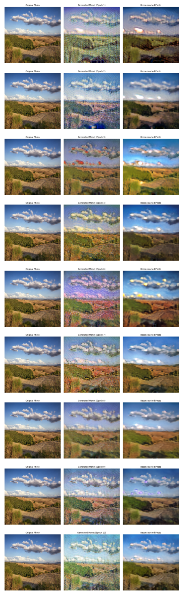
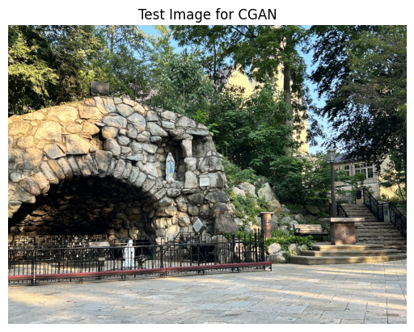
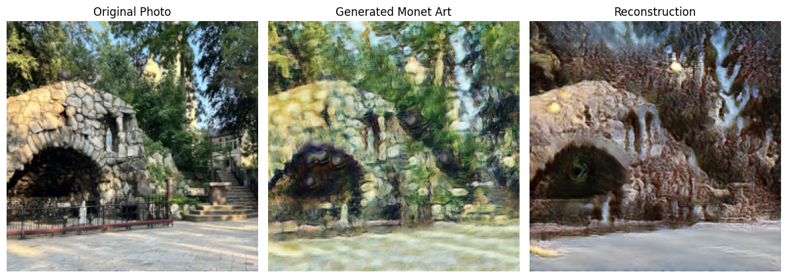

# Image Translation

The project consits of using a Cycle GAN (Generative Adversarial Network) to translate any image into a Claude Monet painting.
I'm going to discuss about the arquitecture of these models and why it is way easier than one might think, pretty intuitive. I hope that you enjoy reading through this repo and get to appreciate the greatness of an artists such as Claude Monet. I will also leave the .pth file and the code on how to set it up in your computer so you can give it a try. 

Thanks for reading!
Luis Martinez

# About Claude Monet

Claude Monet is my favorite artists, one of the things that I admire about him is the peace that his work conveys. I love landscape paintings and the Impressionist movement, most of his paintings were of oil on canvas. 


Other than my admiration for his work and personal bias is that he used the same style through almoast all of his career and his work is readily available to collect. This will be important since we need a good amount of data in order to train the models. 

I will leave the link to the kaggle where I extracted both datasets for this project.


# Data 

First let's download the pictures as a zip file, since I recommend not downloading all the images that we will use for this project. I used google colab for this porject since there is a very easy way to unzip the files in the folder onto the disk without extracting them directly to your drive.

We need to set of datasets for this project, the first one is a dataset about normal pictures that represent things the artists would've painted, in this case I chose the landscape images of kaggle. The next piece of data that we need is actual paintigs of Claude Monet. 

If you are in google colab and create your project folder and store both of these zips on a data folder you can unzip them onto your local zip of your colab instance and it will be much faster for your model to access them and also it will save you a lot of drive space.


```{bash}
#| eval: false

!unzip -q "/content/drive/My Drive/CGAN_MONET/data/trainA.zip" -d "/content/photos"
!unzip -q "/content/drive/My Drive/CGAN_MONET/data/trainB.zip" -d "/content/monet"

```

## Inspecting the data 

Now that we have the pictures in our local disk, we can use some packages in order to walk trough the directory and append those paths into a list. 


```{python}
import os
from os import walk

monet = []
photos = []
for root, dir, files in walk('/content/monet'):
  for f in files:
    monet.append(os.path.join(path_b, f))

for root, dir, files in walk('/content/photos'):
  for f in files:
    photos.append(os.path.join(path_a, f))

```

Now we can see how those images look like


```{python}
from PIL import Image
import matplotlib.pyplot as plt


monet_pics = (Image.open(monet[11]), Image.open(monet[1]), Image.open(monet[300]), 
              Image.open(photos[3]), Image.open(photos[20]), Image.open(photos[30]))
fig, ax = plt.subplots(nrows = 2, ncols=3,  figsize = (10, 5))
ax = ax.flatten()
for idx, pic in enumerate(monet_pics):
  ax[idx].imshow(pic)
  ax[idx].axis('off')
plt.tight_layout()
plt.show()

```


# Model Plan

The way the model works is by constructing 4 different neural networks but each of one with a very specific task to do. See the reason why they are called Adversarial is that well, they are in a tug war. But before we explain this tug war we have to play with the idea of a Autoencoder.

## Autoencoder

It seems like a very scary word but it is very simple, just a big word. When we train a traditional CNN (Convolutional Neural Network) We take an image for example a 256 X 256 X 3 and we compress it using convolutions using kernels, this with the idea that the model learns spatial attention about where to look for classification for example.

Imagine we have a folder that is huge in memory and we create a zip that is a compressed with the "most important info", however when we share that zip we want to expand it and have the original size and files.

That's litterally it, we compress and image using a Encoder and then we assume that if the model really learns the essence of the images it can reconstruct it to the original keeping the structural indentity.

WE have covered almost 50% of the work just in the idea of an Autoencoder, now the missing piece is actually we already know a simple Classification CNN.

## The Tug War

The idea is that we need to create 4 models, 2 that "generate" images either from normal to monet and monet to normal and 2 models that classify images, is it what I saw a real Monet or is it what I saw a real image. 

This creates a tug war where the generators are going to be judge if they are really fooling the discriminators when they generate new art or new pictures, but of course that is not the only thing they will be judge for, more on this in the training part (losses).


## Generators

For the arquitecture of the two generators we need to follow the structure of a autencoder, which is composed of three parts -> Encoder -> Residual Block -> Decoder. We will code them as different blocks and then wire them together to grasp the concept.

### Encoder

```{python}

class Encoder(nn.Module):
  def __init__(self, in_channels, out_channels,
               kernel_size, stride, padding, use_relu = True):
    super().__init__()
    self.conv = nn.Sequential(
        nn.ReflectionPad2d(padding) if padding > 0 else nn.Identity(),
        nn.Conv2d(in_channels, out_channels, kernel_size, stride,
                  padding = 0 if padding > 0 else padding, bias = True),
        nn.InstanceNorm2d(out_channels),
        nn.ReLU(inplace= True) if use_relu else nn.Identity()
    )

  def forward(self, x):
    return self.conv(x)

```

This is the first part in which the images will go through, we create a class for the encoding section. We first need to have a reflection pad.

In normal CNNs we have padding, which is creating "empty" pixels around the image so that the corners are also seen by the model. This ensures that the model also sees the corners multiple times, like those pixels in the center that get overlapped. WIth reflection we can make sure that those pixels in the corners are not black but an outer reflection to create more of a smooth noise. 

When then pass a covolution to crunch those 256 pixels into that 64 X 64 that we will see in the training loop.

To finalize we have a instance normalization, this is the same operation as a Batch Normalization, just for an instance level. This meaning, we normalize the brightness, contrast and color. WHy would we do that ? Because it is not the specific lighting of a photo that we care but that the structural parts are seen like trees and stuff, you know the important stuff.

### Residual Block

Now that we have encoded or translated the image in a way a computer can understand it, by crunching it with convolution, now is the moment for the model to learn the actual style of Monets or Pictures.

```{python}
class Residual(nn.Module):
  def __init__(self, channels):
    super().__init__()
    self.block = nn.Sequential(
        nn.ReflectionPad2d(1),
        nn.Conv2d(channels, channels, kernel_size= 3, padding = 0),
        nn.InstanceNorm2d(channels),
        nn.ReLU(inplace = True),

        nn.ReflectionPad2d(1),
        nn.Conv2d(channels, channels, kernel_size = 3, padding = 0),
        nn.InstanceNorm2d(channels)
    )

  def forward(self, x):
    return x + self.block(x)
```
This might be the most different part from a standard Neural Net from this Autoencoder. 

This is a Residual Block aka ResNet Block (sonds familiar right). In a conventional CNN we would like to expand the data or compress it further, meaning creating more channels; for example 3 -> 32 -> 64 -> 128. However, this has a totally different job, we want to "upgrade" the features in the current depth of channels. 

And this is used in one line the `return x + self.block(x)`, this operation is called skip connection. 

Instead of the model just deleting from it's memory of x was (X is the feature maps) we let it in so that the model remembers the structural patterns (remeber the tree stuff in the encoder) and we add the styles that it learns through this Residual block. That's the reason we do not change the number of channels, since we cannot add tensors with different dimensions.


### Decoder

Now that we have built the encoder, how the model learns the styles and keeps the structure of the image, we are missing one piece, something that brings it back to something we can see, that 256 X 256 X 3 image.


```{python}

class Decoder(nn.Module):
  def __init__(self, in_channels, out_channels):
    super().__init__()
    self.upsample = nn.Sequential(
        nn.Upsample(scale_factor= 2, mode = 'bilinear', align_corners=True),
        nn.Conv2d(in_channels, out_channels, kernel_size= 3, stride = 1, padding = 1),
        nn.InstanceNorm2d(out_channels),
        nn.ReLU(inplace = True)
    )

  def forward(self, x):
    return self.upsample(x)

```

Here we use a upsample fucntion so that we don't look at pixelated pictures that a transposed Conv 2d would give us. We use a resize formula such as bilienar, there is also bicubic which would be a a great change. Then we use a Conv 2D to down scale those channels such as 128 -> 64 -> 32.


## Complete Generator

Now we can bring the three parts all togehter to get a whole generative model.


```{python}

class Generator(nn.Module):
  def __init__(self, img_channels = 3, num_features = 64, num_residual = 9):
    super().__init__()

    self.initial = Encoder(img_channels, num_features, kernel_size= 7, stride = 1,
                           padding = 3)

    self.downsample_1 = Encoder(num_features, num_features * 2, kernel_size = 3,
                                stride = 2, padding = 1)
    self.downsample_2 = Encoder(num_features * 2, num_features * 4, kernel_size = 3,
                                stride = 2, padding = 1)

    self.res_block = nn.Sequential(
        *[Residual(num_features * 4) for _ in range(num_residual)]
    )

    self.upsample_1 = Decoder(num_features * 4, num_features * 2)
    self.upsample_2 = Decoder(num_features * 2, num_features)

    self.last = nn.Sequential(
        nn.ReflectionPad2d(3),
        nn.Conv2d(num_features, img_channels, kernel_size= 7, padding = 0),
        nn.Tanh()
    )

  def forward(self, x):
    x = self.initial(x)
    x = self.downsample_1(x)
    x = self.downsample_2(x)
    x = self.res_block(x)
    x = self.upsample_1(x)
    x = self.upsample_2(x)
    return self.last(x)

```
In order to be easier to understand what happens in this exact part of the code we will use a table, since is easier than raw code. 

| Pipeline Stage | Active Layer | Output Tensor Shape <br>`[Channels, Height, Width]` | Technical Purpose |
| :--- | :--- | :--- | :--- |
| **Input** | *Input* | [3, 256, 256] | Raw RGB input data. |
| **Encoder** | initial_layer | [64, 256, 256] | Stabilizes features with a large $7\times7$ patch. |
| **Encoder** | down_1 & down_2 | [256, 64, 64] | Spatially squashes image by $4\times$, expanding channels. |
| **Bottleneck** | residuals ($\times9$) | [256, 64, 64] | Monet's style modifications via **Skip Connections**. |
| **Decoder** | up_1 & up_2 | [64, 256, 256] | Smoothly stretches spatial geometry back out using **Bilinear Interpolation**. |
| **Output**| last | [3, 256, 256] | Compresses channels to 3 (RGB) and anchors pixels with Tanh(). |

When we see this table we can see that it works with a mirror, the down sample and the upsample code are mirroring themselves in the number of features. Then we pass through the residual 9 times to get those styles.

We use `Tanh()` so all pixels are compressed into a [-1, 1] range. 


## Discriminators 

Now we need to build the detectives that will judge if what they saw are real Monets (Monet Picture) or a real picture (Real Picture Expert). Both will have the same structure and has the same strcuture as a normal CNN but with a little twist in the way it classifies the probability.

```{python}
class Discriminator(nn.Module):
  def __init__(self, img_channels = 3, features = [64, 128, 256, 512]):

    super().__init__()

    self.initial = nn.Sequential(
        nn.Conv2d(img_channels, features[0], kernel_size = 4, stride = 2, padding = 1),
        nn.LeakyReLU(0.2, inplace = True)
    )

    layers = []

    in_channels = features[0]
    for feature in features[1:]:
      stride = 1 if feature == features[-1] else 2
      layers.append(
          nn.Sequential(
              nn.Conv2d(in_channels, feature, kernel_size=4, stride = stride, padding = 1,
                        padding_mode= 'reflect'),
              nn.InstanceNorm2d(feature),
              nn.LeakyReLU(0.2,  inplace = True)
          )
      )
      in_channels = feature

    self.layers = nn.Sequential(*layers)

    self.patch_out = nn.Conv2d(in_channels, 1, kernel_size = 4, stride = 1,
                               padding = 1, padding_mode = 'reflect')

  def forward(self, x):
    x = self.initial(x)
    x = self.layers(x)
    return self.patch_out(x)
```
WE pass first the image channels into an inintial convolutional layer, this just to do an initial compression expandin g the channels.

WE use a fast way to code the number of channels in each layer, dictated by the list of features. Our attention should go into what says patch out.

In most CNNs we just output one single value via softmax of a probability of 0-1, but this forces the model to only learn the general idea of all the image. We need strong discriminators since they will make our generators stronger, this are lazy models that if they trick one corner, then they will continue to do that. Therefore we output probabilities for different regions of the picture making that we have better translation and more sharper generations.

## Losses

THis is the most important part of the whole training, we could have brilliant arquitectures but at the end of the day we need to set the game rules, how will our models be judged. Remeber this models are lazy and if they can find a way to half a\** their job they will. 

For this we need to take 3 things into consideration, here is why we need that second generator from Monet art pieces to normal pictures.


$$\mathcal{L}_{\text{Total}} = \mathcal{L}_{\text{GAN}} + \lambda_{\text{cycle}}\mathcal{L}_{\text{cycle}} + \lambda_{\text{id}}\mathcal{L}_{\text{identity}}$$

Where $$\lambda$$ indicates how much we care about each loss via a coefficient. 

### Adversarial Loss

This is the first part of the puzzle we use Mean Squarred Error/Least Square Loss to see if the Generator is able to fool the Discriminator, meaning the Generator wants the Discriminator to output a bunch of 1.0 as in this is a real Monet, we apply the same for the second Generator.

## Cycle Consistency Loss

This is the round trip error, we take a picture -> convert to Monet -> convert to Picture again. This is so that we keep the structural such as trees and stuff hehe. So if the Monet Generator starts doing crazy structural changes such as deleting trees or clouds, this error catches. This is done by calculating the distance between pixels of the Generated round trip and the original.

## Indentity Loss

If our Monet Generator really knows about Monet, well if we give it a real Monet, it should output something almost the same. This makes that we have the same background distributions based on real Monets.


```{python}
gen_A2B = Generator().to(device) # normal to Monet
gen_B2A = Generator().to(device) # Monet to normal

disc_A = Discriminator().to(device) # Is this a real photo ?
disc_B = Discriminator().to(device) # Is this a real Monet ?

opt_gen = optim.Adam(
    list(gen_A2B.parameters()) + list(gen_B2A.parameters()),
    lr = 2e-4,
    betas = (0.5, 0.999)
)
opt_dis = optim.Adam(
    list(disc_A.parameters()) + list(disc_B.parameters()),
    lr = 2e-4,
    betas = (0.5, 0.999)
)

mse_loss = nn.MSELoss() # Did we fool the Judge
l1_loss = nn.L1Loss() # translation error
```

## Training Loop

Now we just need to pass the training loop and calculate the backpropagation based on these losses. 

**Note: on script.py is the Dataset Class and data loader**


```{python}

def train_fn(disc_A, disc_B, gen_A2B, gen_B2A, dataloader, opt_dis,
             opt_gen, mse_loss, l1_loss, device):
  disc_A.train()
  disc_B.train()
  gen_A2B.train()
  gen_B2A.train()

  loop = tqdm(dataloader, leave = True)
  num_batches = len(dataloader)


  for idx, (real_photo, real_monet) in enumerate(loop):

    #### Train Generators
    real_photo = real_photo.to(device)
    real_monet = real_monet.to(device)

    opt_gen.zero_grad()

    # Loss of fooling detective
    fake_monet = gen_A2B(real_photo)
    disc_B_fake_pred = disc_B(fake_monet)
    loss_G_A2B_adv = mse_loss(disc_B_fake_pred, torch.ones_like(disc_B_fake_pred))
    fake_photo = gen_B2A(real_monet)
    disc_A_fake_pred = disc_A(fake_photo)
    loss_G_B2A_adv = mse_loss(disc_A_fake_pred, torch.ones_like(disc_A_fake_pred))

    # Loss in translation (like the movie)
    rec_photo = gen_B2A(fake_monet)
    loss_cycle_photo = l1_loss(real_photo, rec_photo) * 10.0
    rec_monet = gen_A2B(fake_photo)
    loss_cycle_monet = l1_loss(real_monet, rec_monet) * 10.0

    # loss in identity

    id_monet = gen_A2B(real_monet)
    loss_id_monet = l1_loss(real_monet, id_monet) * 5.0
    id_photo = gen_B2A(real_photo)
    loss_id_photo = l1_loss(real_photo, id_photo) * 5.0

    total_loss_G = (
            loss_G_A2B_adv + loss_G_B2A_adv +
            loss_cycle_photo + loss_cycle_monet +
            loss_id_photo + loss_id_monet
        )

    total_loss_G.backward()
    opt_gen.step()


############# Train detectives
    opt_dis.zero_grad()

#### Train monet detective
    dis_B_real_pred = disc_B(real_monet)
    loss_disc_B_real = mse_loss(dis_B_real_pred, torch.ones_like(dis_B_real_pred))
    disc_B_fake_pred = disc_B(fake_monet.detach())
    loss_disc_B_fake = mse_loss(disc_B_fake_pred, torch.zeros_like(disc_B_fake_pred))
    loss_disc_B = (loss_disc_B_real + loss_disc_B_fake) * 0.5

    # real photo detective
    disc_A_real_pred = disc_A(real_photo)
    loss_disc_A_real = mse_loss(disc_A_real_pred, torch.ones_like(disc_A_real_pred))
    disc_A_fake_pred = disc_A(fake_photo.detach())
    loss_disc_A_fake = mse_loss(disc_A_fake_pred, torch.zeros_like(disc_A_fake_pred))
    loss_disc_A = (loss_disc_A_real + loss_disc_A_fake) * 0.5


    total_loss_D = loss_disc_B + loss_disc_A

    total_loss_D.backward()
    opt_dis.step()

    if idx % 10 == 0:
      loop.set_postfix(Loss_G = total_loss_G.item(), Loss_D = total_loss_D.item())

```


On traditional CNN's we can see that convergence is graphed with train loss and validation loss, here both Generator loss and Discriminator Loss is oscillating, battling against each other. But since we have a very deep understanding about what the models are doing and what they are being judge for, we can see each epoch in this case 10 and see how it converges.




The first thing that we can see is that through the epochs our model has a very good structural generation meaning, it keeps the trees, clouds and everything where it should be. This is not hard to see since we assigned it a 10 coefficient to the round trip remeber that Cycle Loss and we assigned a 5 coefficient to the loss in identity, therefore our models are not tweaking the structure of the image as much as the style.

We can clearly see through the imgages how they chagne their color pallete and triying to nail that washed type of impressionist style. ON that last epoch we can see that the model has attained it in a almoast clear way, which is awesome. We could tweak the losses so that our model concentrates more on the strcture or the style, those are the knobs.

# Test

Now we want to see if we can take a picture that the model has never seen before and see how the model generator performs by then give that generated picture to the discriminator, so let's check it out.

For this test we will use this beatiful image of the Grotto I took.



We can generate some images by running the evaluation of our models.


```{python}

gen_A2B.eval()

normal_image_tensor = normal_image.to(device)
monet_image_tensor = monet_image.to(device)

with torch.no_grad():
    fake_monet = gen_A2B(normal_image_tensor)
    recon = gen_B2A(normal_image_tensor)
    img_original = (normal_image_tensor.squeeze(0) * 0.5 + 0.5).permute(1, 2, 0).cpu().numpy()
    img_monet = (fake_monet.squeeze(0) * 0.5 + 0.5).permute(1, 2, 0).cpu().numpy()
    recon_image = (recon.squeeze(0) * 0.5 + 0.5).permute(1, 2, 0).cpu().numpy()

    fake_normal = gen_B2A(monet_image_tensor)
    recon_2 = gen_A2B(monet_image_tensor)
    original = (monet_image_tensor.squeeze(0) * 0.5 + 0.5).permute(1, 2, 0).cpu().numpy()
    fake = (fake_normal.squeeze(0) * 0.5 + 0.5).permute(1, 2, 0).cpu().numpy()
    monet_recon = (recon_2.squeeze(0) * 0.5 + 0.5).permute(1, 2, 0).cpu().numpy()

```


We can see the result of the Generation of the Image and the Complete cycle integration meaning giving the full ride trip.



WE can review what our model thinks this by looking at the probability of the grid.


```{python}
disc_B.eval()

with torch.no_grad():
  raw_prediction = disc_B(fake_monet)
  probabilities = torch.sigmoid(raw_prediction)
  average_score = torch.mean(probabilities).item()

```

**50.91%**

Basically for the model it is a coin toss.


